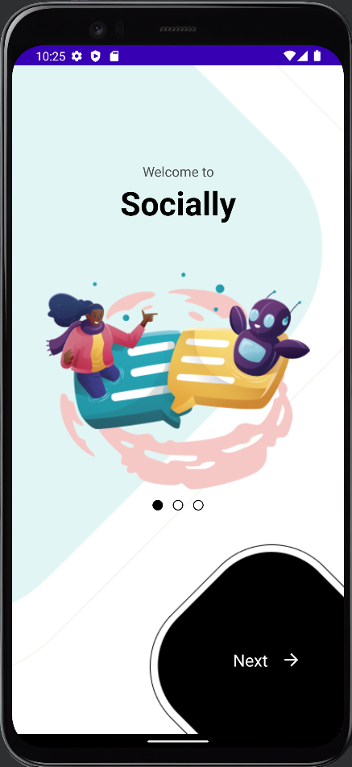
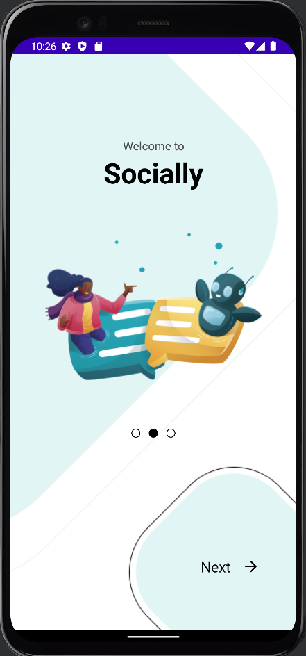
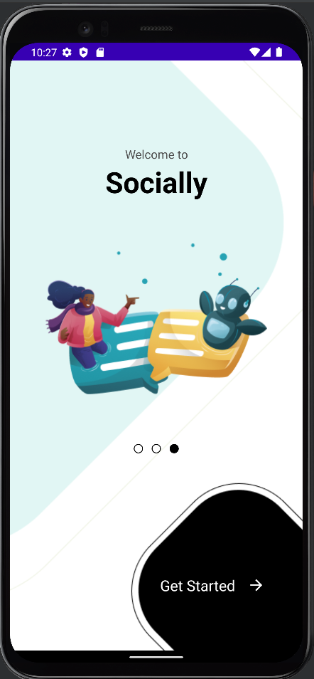
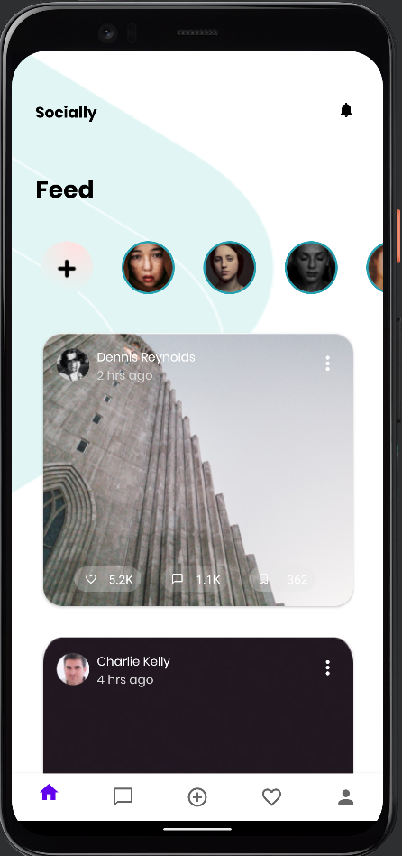
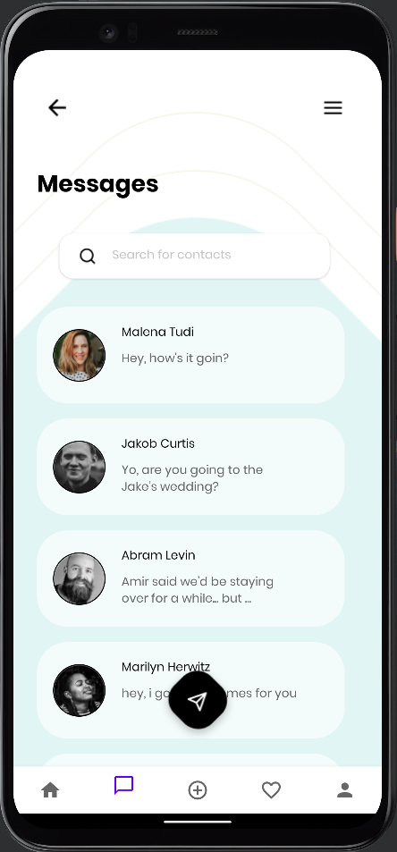
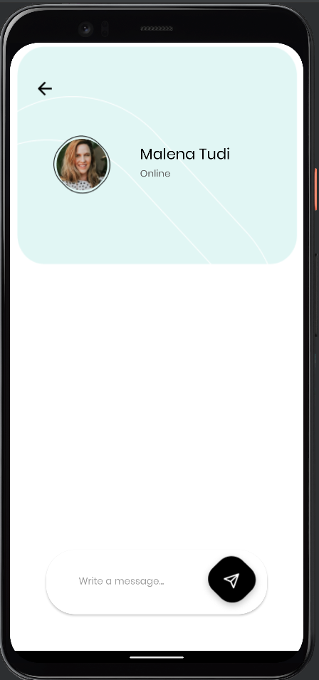
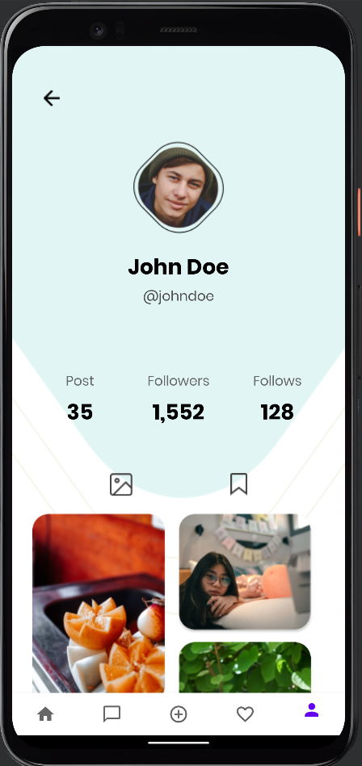

# Socially

## Project Information

- This is a social media app example.

- There are 3 splash screen.

- 5 Pages
  + Home (Active)
  + Messages (Active)
  + Sharing
  + Favorites
  + Profile (Active)
  

## Tech

- RecyclerView horizontal and vertical

- Bottom Navigation View

- Fragments

- DataBinding

- Shared Preferences

- Firebase Crashlytics

- Firebase Analytics

---

### Screenshots

  
<table>
  <tr>
    <td></td>
    <td></td>
    <td></td>
  </tr>
 </table>
  
 
   
<table>
  <tr>
    <td></td>
    <td></td>
    <td></td>
    <td></td>
  </tr>
 </table>
  

